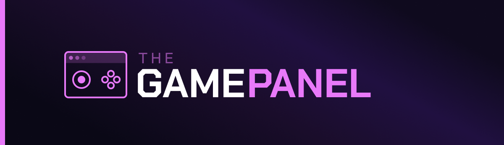

# The Game Panel

## Open-source game server management

The core engine that powers The Game Panel. It provides the foundational architecture that everything else is built on
top of — the boot pipeline, kernel abstraction, module system, and the core concepts around contexts, roles, and
permissions.

This package is to The Game Panel what laravel/framework is to Laravel. You wouldn't typically depend on this directly;
instead, you'd install The Game Panel and build on top of it using the module system.

For more details about how the engine works, check out the [docs](docs) directory.
